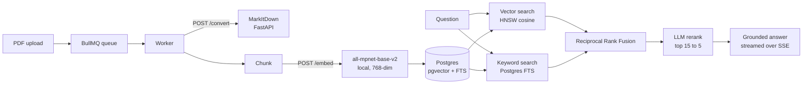

# DocTalk

**Ask your documents. Get answers with receipts.**

Upload PDFs, ask questions in plain language, and get answers grounded in the
actual text — cited line by line, and honest enough to say when the answer
isn't in there.

Anyone can stuff a PDF into a prompt. The hard part is finding the right
passage in a pile of them and proving the answer came from there. That's what
this is built around.

---

## How it works



**Ingestion.** Each uploaded PDF becomes a queued job. The worker validates the
file signature, hashes it to skip duplicates within a notebook, converts it to
Markdown via the MarkItDown service, then chunks, embeds and stores it. Progress
for every stage is reported back to the UI while it runs.

**Retrieval.** A question runs vector search and full-text search *in parallel*,
then merges the two rankings with Reciprocal Rank Fusion — so semantic matches
and exact keyword hits both survive. Fusion is fast but blunt, so a second model
reads the top 15 candidates and scores them for real relevance, keeping the best
5 for the answer prompt.

**Answering.** The model may only answer from the retrieved context and must
cite each passage inline with `[n]`. Tokens stream back over Server-Sent Events;
citations resolve at the end, each linking to the exact snippet it came from.

## Design decisions worth explaining

- **Hybrid over pure vector.** Vector search alone misses exact terms (error
  codes, names, clause numbers). Keyword search alone misses paraphrase. RRF
  merges both without hand-tuning a weight.
- **Local embeddings.** `all-mpnet-base-v2` runs inside the MarkItDown
  container — no API key, no rate limit, no per-call cost, and no document text
  leaving the stack for a third party.
- **HNSW, not IVFFlat.** IVFFlat has poor recall on small corpora; with only a
  handful of chunks it returned almost nothing. HNSW behaves on both small and
  large collections.
- **Groq for generation.** Gemini's free tier shares one low daily quota across
  every Flash model, which a single heavy session exhausts. `LLM_PROVIDER` still
  switches back to Gemini if you want it.
- **Stateless auth.** The API verifies RS256 tokens against the auth service's
  JWKS endpoint — no database round trip on the hot path.
- **Resilience.** Retry with backoff on 429/503, a minimum gap between
  generation calls, and a circuit breaker around both the LLM and MarkItDown.

## Stack

| Layer | Choice |
|---|---|
| API | Express 5 + TypeScript, `tsx` |
| Queue | BullMQ + Redis (worker concurrency 3) |
| Database | Postgres + pgvector (HNSW cosine) + `tsvector` GIN index |
| Embeddings | `all-mpnet-base-v2` via sentence-transformers, 768-dim |
| Generation | Groq — `openai/gpt-oss-120b` (answers), `openai/gpt-oss-20b` (rerank) |
| Conversion | MarkItDown behind FastAPI |
| Frontend | React 18 + Vite |
| Auth | Separate service — RS256 JWTs, JWKS, OAuth, TOTP MFA |
| Monorepo | pnpm workspaces + Turborepo |

## Running it

Requires Docker, Node 20+, pnpm, and a Postgres database with pgvector
(a free [Neon](https://neon.tech) project works).

```bash
pnpm install
cp backend/.env.example backend/.env       # then fill in DATABASE_URL + GROQ_API_KEY
pnpm --filter backend migrate              # applies db/schema.sql
pnpm dev
```

`pnpm dev` starts Redis, MarkItDown, the auth database and the auth API in
Docker, then runs the API, worker and frontend locally:

| Service | URL |
|---|---|
| Frontend | http://localhost:5174 |
| API | http://localhost:3000 |
| MarkItDown | http://localhost:8000 |
| Auth API | http://localhost:4000 |

To run everything — both apps, all eight services — in containers instead:

```bash
docker compose -f docker-compose.full.yml up --build
```

### Configuration

`backend/.env`:

| Variable | Required | Notes |
|---|---|---|
| `DATABASE_URL` | yes | Postgres with pgvector; append `?sslmode=require` for Neon |
| `GROQ_API_KEY` | yes | Generation and reranking |
| `REDIS_URL` | | Defaults to `redis://localhost:6379` |
| `MARKITDOWN_URL` | | Defaults to `http://localhost:8000`; also serves `/embed` |
| `AUTH_JWKS_URL`, `AUTH_ISSUER`, `AUTH_AUDIENCE` | | Defaults match the auth service |
| `LLM_PROVIDER` | | `groq` (default) or `gemini` |
| `GEMINI_API_KEY` | | Only when `LLM_PROVIDER=gemini` |
| `CHAT_MODEL`, `UTIL_MODEL`, `LLM_MIN_GAP_MS` | | Model and pacing overrides |

## Deploying

The whole stack runs as **one container**: the API (worker in-process) serving
the built frontend, MarkItDown, and the auth service. Only the public port is
exposed — the API proxies `/auth`, `/mfa` and `/oauth` to the auth service over
loopback, so the browser sees one origin and its cookies stay first-party.

Two hosts are supported. **Render is the only free one; Spaces is the better one
if you'll pay for it.**

| | Render (free) | HF Spaces (needs Pro) |
|---|---|---|
| RAM / CPU | 512 MB · 0.1 CPU | **16 GB · 2 vCPU** |
| Sleeps after | 15 minutes | **48 hours** |
| Embeddings | needs an API key | **local model, no key** |
| Re-ingest needed | yes — different vector space | **no** |
| Redis | free Key Value | in-container |
| Image | [`Dockerfile.render`](Dockerfile.render) | [`Dockerfile`](Dockerfile) |

Spaces used to be the free recommendation and the images were built for it. As
of **July 2026** Hugging Face removed the free CPU Basic tier and restricted the
Docker SDK to paid accounts — a free account gets ZeroGPU only, which won't run
this. The Spaces path below is unchanged and still correct; it just costs money
now. A Static Space is not a fallback: it serves files, and this needs a server.

Both need a Postgres with pgvector (a free [Neon](https://neon.tech) project —
Render's own free database is deleted after 30 days) and a `GROQ_API_KEY`.
Point both database URLs at the same database; DocTalk uses `public` and the
auth service gets its own schema. Only Prisma reads `?schema=`, so the suffix
lands the auth tables where they belong while DocTalk's `pg` pool ignores it and
stays on `public`:

```
DATABASE_URL       postgresql://…/neondb?sslmode=require
AUTH_DATABASE_URL  postgresql://…/neondb?sslmode=require&schema=auth
```

**On Supabase, two things differ.** Both are silent traps:

1. **Don't use `schema=auth`** — Supabase reserves `auth` for its own GoTrue
   tables (`auth.users` et al). It already exists and is already populated, so
   `prisma migrate deploy` aborts with `P3005: schema is not empty`, and every
   auth table stays missing (`P2021`) until you rename. Migrating *into* it would
   be worse than the error: that schema is Supabase Auth's. Pick an unclaimed
   name and create it first — `CREATE SCHEMA IF NOT EXISTS doctalk_auth;` — and
   avoid `auth`, `storage`, `realtime`, `graphql`, `vault`, `extensions`,
   `pgbouncer`, `cron` and `supabase_*`.
2. **Use the Supavisor session pooler, not the direct host.**
   `db.<ref>.supabase.co` resolves to IPv6 only unless you pay for the IPv4
   add-on, and neither host here has an IPv6 route — it fails with `P1001`. The
   pooler is IPv4 on every tier. Session mode (`:5432`), *not* transaction mode
   (`:6543`), which breaks the `prisma migrate deploy` that `start.sh` runs on
   each boot.

```
DATABASE_URL       postgresql://…pooler.supabase.com:5432/postgres?sslmode=require
AUTH_DATABASE_URL  postgresql://…pooler.supabase.com:5432/postgres?sslmode=require&schema=doctalk_auth
```

### Render — the free path

`render.yaml` is a Blueprint: Dashboard → New → Blueprint → pick this repo, then
fill in the five secrets it prompts for — the four above plus `GEMINI_API_KEY`.
None are optional: `ENCRYPTION_KEY` left blank falls back to a dev default that
the auth service refuses to boot with in production, by design.

The extra key is the price of 512 MB: PyTorch and the all-mpnet-base-v2 weights
need roughly a gigabyte, so `EMBED_PROVIDER=gemini` is forced and
`requirements-slim.txt` drops `sentence-transformers`. **Gemini's vectors are a
different space from the local model's**, so pointing Render at a database
ingested locally means retrieval quietly returns nonsense until you re-ingest.
Measured under `docker run --memory=512m`: ~200 MB idle, ~188 MB after a real
signup, login and API queries — it fits, and 0.1 CPU is the real bottleneck.

### Hugging Face Spaces — needs a paid plan

Create a Space with **Docker** as the SDK and push this repo to it. The YAML
header at the top of this README configures it (`sdk: docker`, `app_port: 7860`).
Add four Space secrets: `DATABASE_URL`, `AUTH_DATABASE_URL`, `GROQ_API_KEY` and
`ENCRYPTION_KEY` (`openssl rand -hex 32`). That's all — embeddings run locally
in the container, so there's no embedding key and vectors stay identical to a
local run.

The Docker SDK and CPU Basic hardware both require Pro as of July 2026; on a free
account the SDK is marked paid at creation time and you can't select the
hardware.

Use the direct `https://<user>-<space>.hf.space` URL. The huggingface.co page
frames the Space in an iframe, which makes the auth cookies third-party and
blocks sign-in.

### True of both

- **No persistent disk**, so the auth service regenerates its RSA keys on each
  boot: every deploy signs everyone out.
- **The queue is transient** — in-flight jobs are lost on restart.
- Free tiers sleep. Nothing progresses while the container is asleep.

## API

All routes except `/hello` and `/health` require a bearer token or the
`access_token` cookie, and are scoped to the calling user.

| Method | Route | |
|---|---|---|
| `GET` | `/health` | Database, queue and MarkItDown status |
| `GET` `POST` `PATCH` `DELETE` | `/notebooks[/:id]` | Notebook CRUD |
| `GET` | `/notebooks/:id/documents` | Documents with chunk counts, paginated |
| `POST` | `/pdfs` | Batch upload, returns queued job ids (200 MB/file) |
| `GET` | `/jobs?ids=` | Per-file ingestion progress |
| `POST` | `/ask` | `{ question, notebookId, topN?, rerank? }`, SSE stream |
| `DELETE` | `/documents/:id` | Remove a document and its chunks |
| `POST` | `/reset` | Clear a notebook |

Rate limits: 120 req/min globally, 30/min on `/ask`, 10/min on uploads.

## Repository layout

```
backend/              Express API + BullMQ worker
  ai/                 embeddings, LLM provider switch, reranker
  db/                 pool, schema, migrations, vector + keyword search
  lib/                chunking, RRF fusion, retry, throttle, circuit breaker
  services/           ingest, ask (retrieve + stream)
frontend/             React + Vite client
markitdown-service/   FastAPI: PDF to Markdown, and /embed
auth/                 Auth microservice (API + web)
```

## Notes

- Free-tier LLM providers may train on input. Use documents you're comfortable
  sending, and treat generated answers as a starting point, not a verdict.
- The local Docker Compose stack sets `--dns-result-order=ipv4first` on the API
  and worker: those containers have no IPv6 route to a cloud Postgres. The
  deploy images don't set it, and it wouldn't help there anyway — the flag only
  reorders DNS results, so it can't reach a host that has no IPv4 record at all.
  Supabase is the case that bites: `db.<ref>.supabase.co` resolves to IPv6 only
  unless you buy the IPv4 add-on, so use the Supavisor **session pooler** string
  (`…pooler.supabase.com:5432`) for both database URLs. Session mode, not
  transaction mode (`:6543`) — Prisma migrations fail through the latter, and
  `start.sh` runs `prisma migrate deploy` on every boot.
