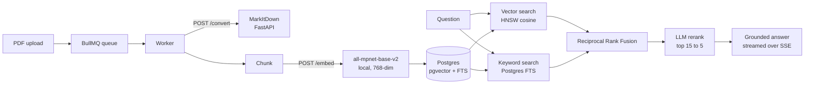

# DocTalk

**Ask your documents. Get answers with receipts.**

Upload PDFs, ask questions in plain language, and get answers grounded in the
actual text — cited line by line, and honest enough to say when the answer
isn't in there.

Anyone can stuff a PDF into a prompt. The hard part is finding the right
passage in a pile of them and proving the answer came from there. That's what
this is built around.

---

## How it works



**Ingestion.** Each uploaded PDF becomes a queued job. The worker validates the
file signature, hashes it to skip duplicates within a notebook, converts it to
Markdown via the MarkItDown service, then chunks, embeds and stores it. Progress
for every stage is reported back to the UI while it runs.

**Retrieval.** A question runs vector search and full-text search *in parallel*,
then merges the two rankings with Reciprocal Rank Fusion — so semantic matches
and exact keyword hits both survive. Fusion is fast but blunt, so a second model
reads the top 15 candidates and scores them for real relevance, keeping the best
5 for the answer prompt.

**Answering.** The model may only answer from the retrieved context and must
cite each passage inline with `[n]`. Tokens stream back over Server-Sent Events;
citations resolve at the end, each linking to the exact snippet it came from.

## Design decisions worth explaining

- **Hybrid over pure vector.** Vector search alone misses exact terms (error
  codes, names, clause numbers). Keyword search alone misses paraphrase. RRF
  merges both without hand-tuning a weight.
- **Local embeddings.** `all-mpnet-base-v2` runs inside the MarkItDown
  container — no API key, no rate limit, no per-call cost, and no document text
  leaving the stack for a third party.
- **HNSW, not IVFFlat.** IVFFlat has poor recall on small corpora; with only a
  handful of chunks it returned almost nothing. HNSW behaves on both small and
  large collections.
- **Groq for generation.** Gemini's free tier shares one low daily quota across
  every Flash model, which a single heavy session exhausts. `LLM_PROVIDER` still
  switches back to Gemini if you want it.
- **Stateless auth.** The API verifies RS256 tokens against the auth service's
  JWKS endpoint — no database round trip on the hot path.
- **Resilience.** Retry with backoff on 429/503, a minimum gap between
  generation calls, and a circuit breaker around both the LLM and MarkItDown.

## Stack

| Layer | Choice |
|---|---|
| API | Express 5 + TypeScript, `tsx` |
| Queue | BullMQ + Redis (worker concurrency 3) |
| Database | Postgres + pgvector (HNSW cosine) + `tsvector` GIN index |
| Embeddings | `all-mpnet-base-v2` via sentence-transformers, 768-dim |
| Generation | Groq — `openai/gpt-oss-120b` (answers), `openai/gpt-oss-20b` (rerank) |
| Conversion | MarkItDown behind FastAPI |
| Frontend | React 18 + Vite |
| Auth | Separate service — RS256 JWTs, JWKS, OAuth, TOTP MFA |
| Monorepo | pnpm workspaces + Turborepo |

## Running it

Requires Docker, Node 20+, pnpm, and a Postgres database with pgvector
(a free [Neon](https://neon.tech) project works).

```bash
pnpm install
cp backend/.env.example backend/.env       # then fill in DATABASE_URL + GROQ_API_KEY
pnpm --filter backend migrate              # applies db/schema.sql
pnpm dev
```

`pnpm dev` starts Redis, MarkItDown, the auth database and the auth API in
Docker, then runs the API, worker and frontend locally:

| Service | URL |
|---|---|
| Frontend | http://localhost:5174 |
| API | http://localhost:3000 |
| MarkItDown | http://localhost:8000 |
| Auth API | http://localhost:4000 |

To run everything — both apps, all eight services — in containers instead:

```bash
docker compose -f docker-compose.full.yml up --build
```

### Configuration

`backend/.env`:

| Variable | Required | Notes |
|---|---|---|
| `DATABASE_URL` | yes | Postgres with pgvector; append `?sslmode=require` for Neon |
| `GROQ_API_KEY` | yes | Generation and reranking |
| `REDIS_URL` | | Defaults to `redis://localhost:6379` |
| `MARKITDOWN_URL` | | Defaults to `http://localhost:8000`; also serves `/embed` |
| `AUTH_JWKS_URL`, `AUTH_ISSUER`, `AUTH_AUDIENCE` | | Defaults match the auth service |
| `LLM_PROVIDER` | | `groq` (default) or `gemini` |
| `GEMINI_API_KEY` | | Only when `LLM_PROVIDER=gemini` |
| `CHAT_MODEL`, `UTIL_MODEL`, `LLM_MIN_GAP_MS` | | Model and pacing overrides |

## Deploying (Render, free tier)

`render.yaml` is a Blueprint that runs the whole thing as **one** free web
service. Render Dashboard → New → Blueprint → pick this repo, then fill in the
five secrets it prompts for: `DATABASE_URL`, `AUTH_DATABASE_URL`,
`GROQ_API_KEY`, `GEMINI_API_KEY` and `ENCRYPTION_KEY`
(`openssl rand -hex 32`).

Point both database URLs at the same Postgres — DocTalk uses the `public`
schema, the auth service gets its own via `?schema=auth`:

```
DATABASE_URL       postgresql://…/neondb?sslmode=require
AUTH_DATABASE_URL  postgresql://…/neondb?sslmode=require&schema=auth
```

One container ([`Dockerfile`](Dockerfile), [`start.sh`](start.sh)) runs three
runtimes: the API (with the worker in-process) serving the built frontend on
`$PORT`, MarkItDown on loopback `:8000`, and the auth service on loopback
`:4000`. Only `$PORT` is exposed; the API proxies `/auth`, `/mfa` and `/oauth`
to the auth service so the browser sees one origin and its cookies stay
first-party.

**Read this before relying on it.** The free tier is a demo, not a deployment:

- **512 MB RAM and 0.1 CPU** for all three runtimes together. Measured under
  `docker run --memory=512m`: ~200 MB idle, ~188 MB after a signup, login and
  API queries — so it fits with room to spare. Both Node heaps are capped in
  `start.sh` as insurance, since an uncapped heap grows toward the container
  limit under pressure. The 0.1 CPU is the likelier bottleneck: cold starts and
  PDF conversion will be slow.
- **Embeddings must run via API here.** `EMBED_PROVIDER=gemini` is forced,
  because PyTorch plus the all-mpnet-base-v2 weights need roughly a gigabyte.
  The two providers are different vector spaces, so **switching invalidates
  every stored embedding** — re-ingest, or retrieval quietly returns nonsense.
- **Spins down after 15 minutes idle**, ~1 minute cold start. Queued uploads
  don't progress while it's asleep. 750 free instance hours per workspace/month.
- **No persistent disk**, so the auth service regenerates its RSA keys on every
  boot: each deploy signs everyone out.
- **Free Key Value has no persistence** — in-flight jobs are lost on restart.
- Render's own free Postgres is **deleted 30 days after creation**, which is why
  the blueprint asks for an external URL (a free Neon project doesn't expire)
  rather than provisioning one.

## API

All routes except `/hello` and `/health` require a bearer token or the
`access_token` cookie, and are scoped to the calling user.

| Method | Route | |
|---|---|---|
| `GET` | `/health` | Database, queue and MarkItDown status |
| `GET` `POST` `PATCH` `DELETE` | `/notebooks[/:id]` | Notebook CRUD |
| `GET` | `/notebooks/:id/documents` | Documents with chunk counts, paginated |
| `POST` | `/pdfs` | Batch upload, returns queued job ids (200 MB/file) |
| `GET` | `/jobs?ids=` | Per-file ingestion progress |
| `POST` | `/ask` | `{ question, notebookId, topN?, rerank? }`, SSE stream |
| `DELETE` | `/documents/:id` | Remove a document and its chunks |
| `POST` | `/reset` | Clear a notebook |

Rate limits: 120 req/min globally, 30/min on `/ask`, 10/min on uploads.

## Repository layout

```
backend/              Express API + BullMQ worker
  ai/                 embeddings, LLM provider switch, reranker
  db/                 pool, schema, migrations, vector + keyword search
  lib/                chunking, RRF fusion, retry, throttle, circuit breaker
  services/           ingest, ask (retrieve + stream)
frontend/             React + Vite client
markitdown-service/   FastAPI: PDF to Markdown, and /embed
auth/                 Auth microservice (API + web)
```

## Notes

- Free-tier LLM providers may train on input. Use documents you're comfortable
  sending, and treat generated answers as a starting point, not a verdict.
- Containers here have no IPv6 route, so the API and worker set
  `--dns-result-order=ipv4first` to reach a cloud Postgres.
